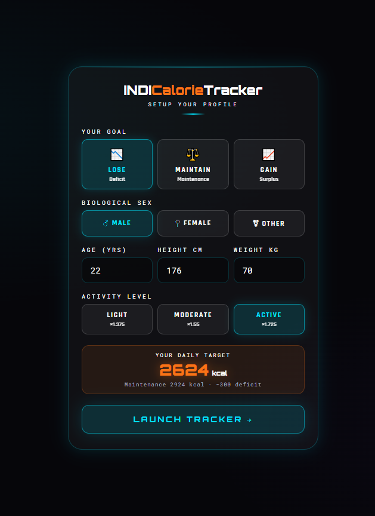
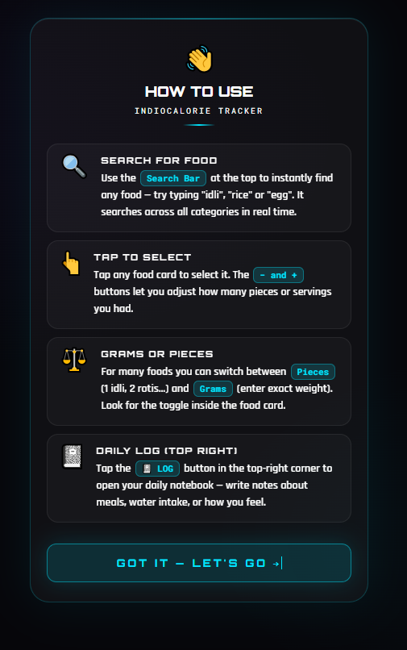
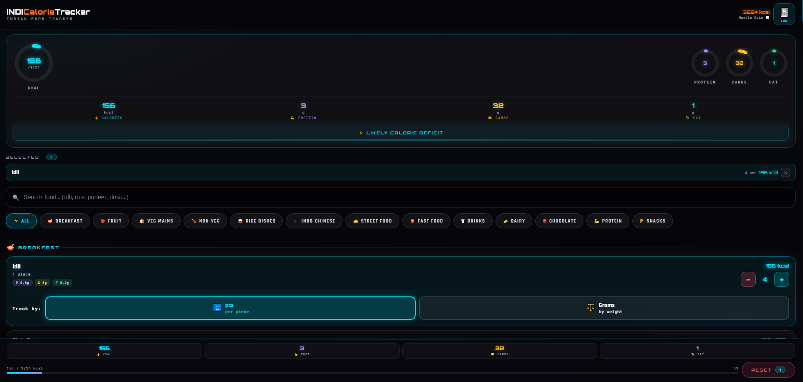

🥗 Indi Calorie Tracker

Indi Calorie Tracker is a browser-based nutrition tracking application designed for Indian dietary habits. It helps users calculate personalized calorie targets and macro breakdowns based on their body profile and fitness goals, while offering a smooth, modern UI experience.

---

## ⚡ Features

- 👤 User profiling (age, height, weight, gender, activity level)
- 🎯 Goal-based calorie calculation (maintain / lose / gain weight)
- 🥦 Macro breakdown (carbohydrates, proteins, fats)
- 🍛 150+ Indian food database for realistic tracking
- 📝 Notes section for daily tracking and personal logs
- 💾 Persistent local storage (data saved in browser)
- 🎨 Clean, modern UI designed for usability and clarity

---

## 🧠 How it works

1. User enters personal details
2. System calculates daily calorie requirement (based on goal)
3. Food intake is selected from built-in Indian food database
4. Macronutrients are automatically calculated
5. Data is stored locally in the browser for persistence

---

## 📸 Interface Preview

### 1. User Profile & Goal Setup
Users enter personal details like age, height, weight, gender, activity level, and fitness goal.  
The system then calculates daily calorie targets based on this data.

---

### 2. How to Use
Step-by-step guide showing how to track food intake and understand calorie + macro flow.

---

### 3. Main Dashboard (Food Tracking & Macros)
Main working screen showing food selection, calorie tracking, and real-time macro breakdown (carbs, protein, fats).

---

## 🚧 Future Improvements

- Backend integration for cloud sync and user accounts
- Mobile app version (React Native or Flutter)
- Expanded Indian food database with more regional dishes
- Smarter recommendation system based on user habits

---

## 📌 Status

MVP (Minimum Viable Product) – actively improving and expanding

---

## ⚡ Built With Purpose

Designed to make nutrition tracking simple, accurate, and relevant for Indian users — combining clean UI with practical functionality.
